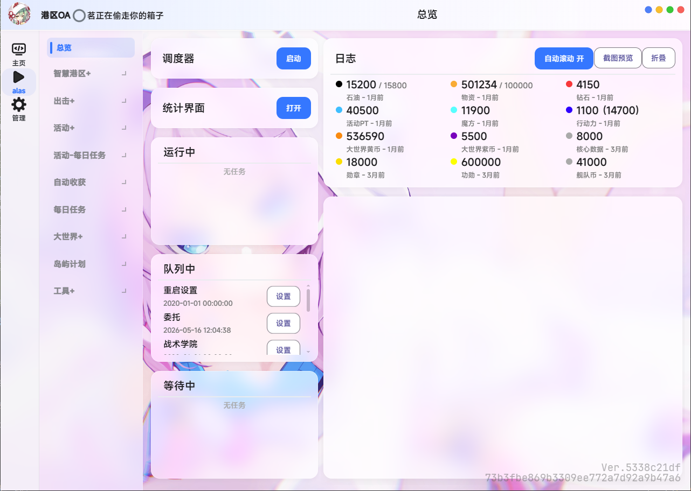

<div align="center">

**饺子可爱捏**

# AzurLaneAutoScript (ALAS) 个人修改版

*碧蓝航线自动化辅助 · GPL-3.0*

</div>

## 项目说明

本项目是 AzurLaneAutoScript 的个人修改版，基于多个分支合并，用于碧蓝航线日常任务、委托、科研、大型作战等自动化流程。

## 合并来源

| 来源 | 说明 |
| --- | --- |
| LmeSzinc/AzurLaneAutoScript | 官方原项目 |
| wess09/AzurPilot | 上游 AzurPilot 分支 |
| 雪风源 | 雪风分支 |
| nanoda | AzurPilot 发布分支 |
| Alas-with-Dashboard | WebUI 面板部分功能 |
| 其他社区 PR | guoh064、sui-feng-cb 等分支的部分功能 |

## 个人修改

<<<<<<< HEAD
在上游分支基础上，本分支新增或修改了以下功能：
=======
路径：大型作战 → 右上角雷达 → 指令模块 → 潜艇支援。

| 设置名称 | 推荐值 |
| --- | --- |
| X 消耗时潜艇出击 | 取消勾选 |

### 一键退役设置

路径：主界面 → 右下角建造 → 左侧边栏退役 → 左侧齿轮图标 → 一键退役设置。

| 设置名称 | 推荐值 |
| --- | --- |
| 选择优先级 1 | R |
| 选择优先级 2 | SR |
| 选择优先级 3 | N |
| 拥有满星的同名舰船时，保留几艘符合退役条件的同名舰船 | 不保留 |
| 没有满星的同名舰船时，保留几艘符合退役条件的同名舰船 | 满星所需或不保留 |

### 图像识别注意事项

请移除以下可能影响识别的内容：

- 角色设备装备
- 角色皮肤
- 可能遮挡界面元素的自定义显示内容

这些内容可能影响图像识别结果，导致自动化流程出现异常。

## MCP 服务

AzurPilot 提供 MCP 服务，可供支持 MCP 的客户端或工具调用，方便使用 Agent 管理 AzurPilot。

> MCP 服务默认随 WebUI 启动并挂载于 `/mcp` 路径下（WebUI 默认端口 25548），也可通过 `uv run python mcp_server_sse.py` 独立运行（独立端口 22268）。
>
> 注意：22268 并非 MCP 专用端口，OCR 服务（`OcrServerPort`）默认也使用该端口。与 WebUI 同机运行独立 MCP 时请留意端口占用冲突。

MCP 复用 WebUI 的密码（`--key` / `config/deploy.yaml` 的 `Password`），未设置密码且监听公网时 WebUI 会自动生成密码，可在根目录 `password.txt` 查看。调用 MCP 时必须携带该密码，否则返回 401。

### 本地连接配置

```json
{
  "mcpServers": {
    "alas": {
      "url": "http://127.0.0.1:25548/mcp/sse",
      "headers": {
        "Authorization": "Bearer <WebUI 密码>"
      }
    }
  }
}
```

### 云服务器或内网连接配置

```json
{
  "mcpServers": {
    "alas": {
      "url": "http://[IP_ADDRESS]:25548/mcp/sse",
      "headers": {
        "Authorization": "Bearer <WebUI 密码>"
      }
    }
  }
}
```

请将 `[IP_ADDRESS]` 替换为实际服务器地址或内网地址；若 WebUI 端口被修改，请同步替换 URL 中的端口。

只能填写 URL、无法自定义请求头的客户端，可以把密码放在查询参数里：`http://[IP_ADDRESS]:25548/mcp/sse?key=<WebUI 密码>`。此时 URL 本身就是凭据，请勿截图外贴或分享；有条件时优先使用请求头。也可用 `X-API-Key: <WebUI 密码>` 请求头代替 `Authorization`。

修改密码后需要重启 WebUI，MCP 才会使用新密码。

### MCP 工具列表

当前可用 MCP 工具共 18 个。

| 类别 | 工具名称 | 功能 |
| --- | --- | --- |
| 实例管理 | `list_instances` | 列出所有实例 |
| | `get_status` | 获取实例状态 |
| | `start_instance` | 启动实例 |
| | `stop_instance` | 停止实例 |
| 任务管理 | `list_tasks` | 列出所有任务 |
| | `get_task_help` | 获取任务帮助 |
| | `trigger_task` | 触发任务 |
| | `get_scheduler_queue` | 获取调度队列 |
| | `clear_scheduler_queue` | 清空调度队列 |
| 监控与信息 | `get_current_running_task` | 获取当前运行任务 |
| | `get_resources` | 获取资源状态 |
| | `get_config` | 获取实例配置 |
| | `get_recent_logs` | 获取最近日志 |
| | `get_screenshot` | 获取截图 |
| 配置管理 | `update_config` | 更新配置 |
| 维护工具 | `restart_emulator` | 重启模拟器 |
| | `restart_adb` | 重启 ADB |
| | `update_alas` | 更新 AzurPilot |

## 多平台启动器

> 📥 从 [AzurPilot 官网](https://alas.nanoda.work/download.html) 下载 Windows / macOS / Linux 启动器

<div align="center">
  
  <p>启动加载界面</p>
  
  <p>Windows 客户端界面</p>
  
  <p>Mac 客户端界面</p>
</div>

启动器项目地：[GitHub](https://github.com/wess09/alas-launcher) · 源项目 [ALAS Launcher: 一种新型的 AzurLaneAutoScript 启动器](https://github.com/swordfeng/alas-launcher)

更改内容：

1. 增加托盘化功能
2. Windows 原生推送
3. GUI 样式美化
4. uv 化
...

## 贡献者

由于本项目基于 AzurLaneAutoScript 及其社区分支继续开发，贡献者列表不仅包含本仓库的直接贡献者，也包含上游项目与相关分支中的原始贡献者。

*本项目的贡献名单

<a href="https://github.com/wess09/AzurPilot/graphs/contributors">
  
</a>

*启动器项目的贡献名单

<a href="https://github.com/wess09/alas-launcher/graphs/contributors">
  
</a>

*ALAS原项目的功能名单

<a href="https://github.com/LmeSzinc/AzurLaneAutoScript/graphs/contributors">
  
</a>

## 相关链接

- [AzurPilot 官网](https://alas.nanoda.work/) — 项目介绍、功能详情、碧蓝航线自动化方案
- [AzurPilot 下载页](https://alas.nanoda.work/download.html) — 下载 Windows / macOS / Linux 版本的碧蓝航线脚本工具
- [GitHub 仓库](https://github.com/wess09/AzurPilot) — 源码、Issue、Pull Request
- [QQ 交流群](https://join.nanoda.work/#/) — 碧蓝航线自动化社区交流
- [AzurLaneAutoScript 上游项目](https://github.com/LmeSzinc/AzurLaneAutoScript) — ALAS 原版
- [AzurPilot 树莓派版](https://github.com/nnieie/AzurPilot) — 面向树莓派 / Termux 真机的 AzurPilot CN 部署版

## 开发与贡献

本项目基本完全是 VibeCoding 产物，不足之处请见谅。欢迎通过 Issue 或 Pull Request 反馈问题、提交修复或改进文档。

### 开发环境

```bash
uv sync --frozen        # 创建/同步 .venv（含开发依赖）

# 代码检查（CI 使用 ruff 宽松设置——仅检查致命语法错误和未定义名称）
uv run ruff check . --select E9,F63,F7,F82 --ignore F821,F722

# 测试（约 160 个单元测试）
uv run python -m unittest discover -s tests

# 配置生成（修改配置 YAML 文件后必须执行）
uv run -m module.config.config_updater
```

### 使用过的开发工具与模型

本项目开发过程中使用过多种 AI 模型与开发工具进行辅助。

**AI 模型：**

| | | |
| --- | --- | --- |
| Gemini | GPT | Claude |
| GLM | MiMo | DeepSeek |
| Kimi | Qwen | DouBao |

**开发工具：**

| | | |
| --- | --- | --- |
| Claude Code | Codex | Cursor | Antigravity |
| TRAE | ZCode | OpenCode | MiMoCode |
>>>>>>> upstream_nanoda/master

- **维护模式** — 游戏服务器维护前主动进入维护模式，暂停非必要任务；维护结束后自动恢复完整调度
- **更新提示优化** — 取消全屏更新弹窗，仅保留右上角角标提示，避免打断运行中的任务
- **LLM 分析移除** — 移除 LLM 错误分析功能，禁用不必要的外部 API 连接
- **PT 识别兼容** — 适配「×PT」样式的活动点数识别
- **困难图均衡模式** — 新增均衡刷图开关，支持按图纸类型（驱逐/巡洋/战列/航母）选择关卡，跨天轮转分配每日 3 次困难次数，避免单一图纸偏科
- **刷好感体系** — 共斗牺牲单侧舰船速刷 D 评价（按目标侧手操：刷后排站桩 / 刷前排藏角，双线独立编队与进度）；连战三队接敌（编队 1/2 胜利刷好感，第 3 队牺牲沉船，模式可配置）；主线三任务战斗胜利按接敌舰队累计好感（任务 × 舰队独立计数，满 100 自动暂停）
- **宿舍计划调度优化** — 私人休息室默认 1 点运行规避服务端刷新延迟，互动次数读 0 时当日分段重试（2 小时 / 19 点复查）

## 许可证

本项目遵循原项目及相关上游项目的许可证要求。使用、修改或分发本项目时，请同时遵守相关上游项目的许可证要求。
